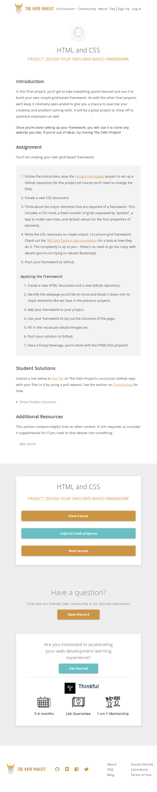
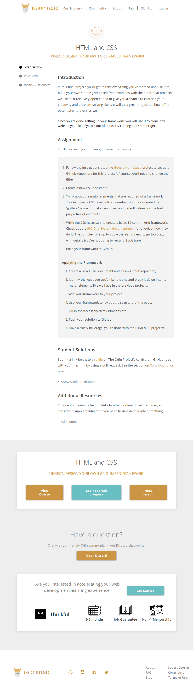

# PROJECT: DESIGN YOUR OWN GRID-BASED FRAMEWORK

This is the eight project of the Main HTML/CSS curriculum at [Microverse](https://www.microverse.org/) - @microverseinc

* The objective is to create a css grid based framework.

#### [Assignment link](https://www.theodinproject.com/courses/html5-and-css3/lessons/design-your-own-grid-based-framework)

### CSS GRID-BASED FRAMEWORK

#### How to use

The Project use the media query (break-point) with  `min-width: 400px`, `min-width: 700px` and `min-width 900px` and the prefix -s, -m and -l was used for the class names respectiely.

#### [Live link](https://bolabuari.com/css-grid-based-framework)

#### Screenshot of clone website used

##### Small Screen 

### Medium Screen

### Large Screen

#### Authors

* [@Torres-ssf](https://github.com/Torres-ssf)
* [@bolah2009](https://github.com/bolah2009/)
